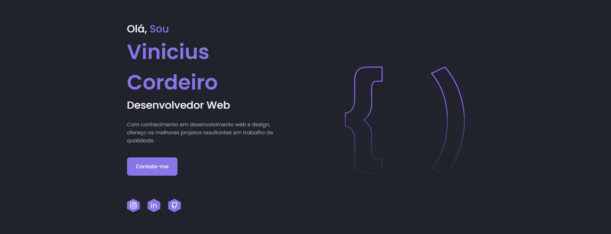

<h1 align="center"> Portifólio Pessoal</h1>

<h4 align="center"><a href="https://viniciusapcordeiro.github.io/Portifolio-ViniciusCordeiro/" target="_blank" >Confira o projeto aqui</a></h4>

## 🤯 O site é composto por:

- **Inicio:** Minha apresentação;
- **Sobre:** Falo um pouco sobre minha trajetória e meu estado atual;
- **Habilidades:** As tecnologias que tenho conhecimento;
- **Projects:** Alguns projetos recentes que fiz;
- **Contato:** Área com meios para contato comigo;
- **Redes:** Minhas redes sociais disponíveis no menu de navegação e no rodapé do site.

## Tecnologias 🚀 

Esse projeto foi desenvolvido com as seguintes tecnologias:

- HTML
- CSS
- Javascript

by [Vinicius Cordeiro]

